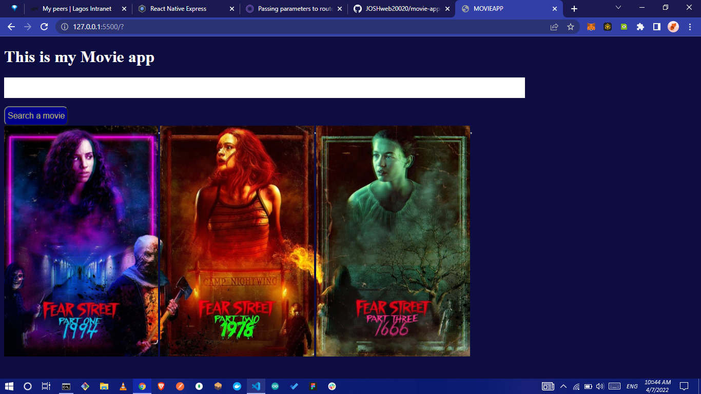
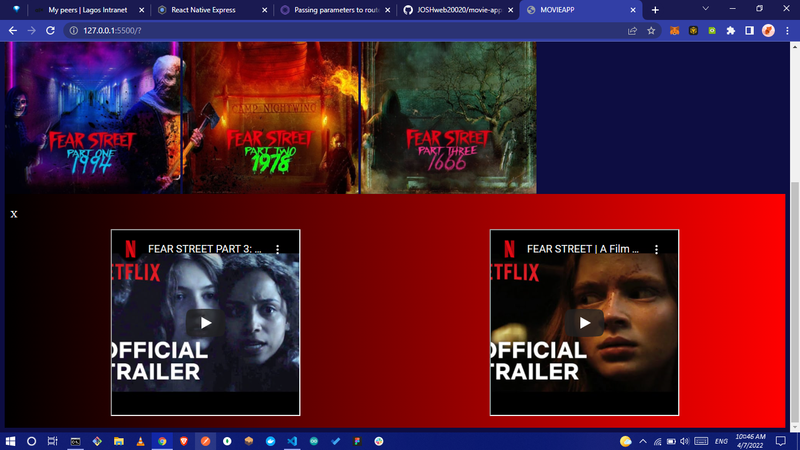

# MOVIE APP

#### Table of contents

-   [Overview](#overview)
    -   [Description](#description)
    -   [Preview of the project](#preview-of-the-project)
    -   [Technologies used](#technologies-used)
-   [Developed by](#developed-by)

## Overview

#### Description

This project uses [TheMovieDb](https://api.themoviedb.org) API to search for popular, trending, latest blockbuster movies
...

### Preview of the project

#### Technologies Used

Project was developed using

-   HTML
-   CSS3
-   JavaScript technologies

No libraries or CSS frameworks were used

### Developed by

> ...
